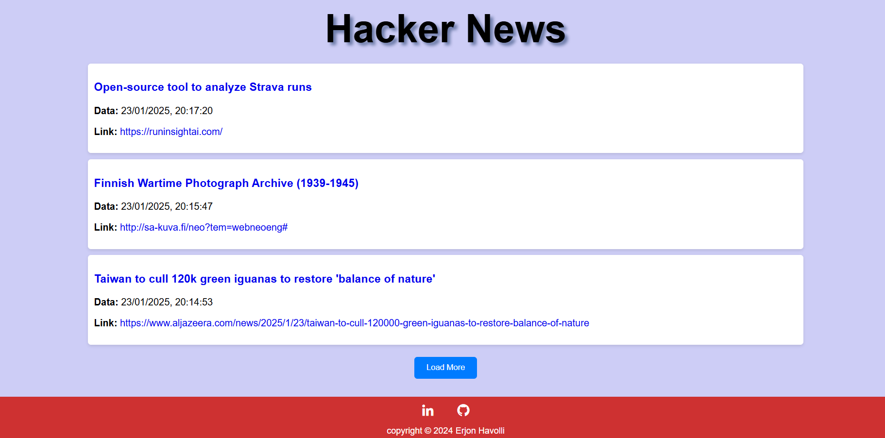

## PANORAMICA DEL PROGETTO:

Questo progetto è un'applicazione web che consente agli utenti di esplorare le ultime notizie tecnologiche provenienti dalla piattaforma Hacker News in tempo reale. Utilizzando le API di Hacker News, l'app recupera e visualizza gli articoli più recenti, includendo dettagli come il titolo, il link e la data di pubblicazione. L'interfaccia è pensata per essere semplice ed efficiente, permettendo agli utenti di caricare altre notizie dinamicamente tramite il pulsante "Load more".

L'obiettivo del progetto è creare uno strumento interattivo e informativo che permetta agli utenti di rimanere aggiornati sulle ultime tendenze tecnologiche.

## COME FUNZIONA

L'applicazione interagisce con l'API di Hacker News per recuperare le ultime notizie. Al caricamento della pagina, l'applicazione recupera un elenco di ID delle storie, preleva i dettagli di ogni storia e li visualizza in un formato semplice e user-friendly.

L'app permette agli utenti di:
- Visualizzare le ultime notizie, comprensive di titolo, data di pubblicazione e link.
- Caricare altre notizie dinamicamente cliccando sul pulsante "Load more".
- Accedere all'articolo originale tramite un link che si apre in una nuova scheda.

I dati visualizzati provengono da Hacker News, garantendo che le informazioni siano sempre aggiornate.

## CARATTERISTICHE

- **Dati in tempo reale**: Recupera le ultime notizie tecnologiche dalla piattaforma Hacker News.
- **Caricamento dinamico**: Il pulsante "Carica altro" consente agli utenti di caricare articoli aggiuntivi senza ricaricare la pagina.
- **Navigazione semplice**: Ogni articolo include un link che reindirizza gli utenti al post originale su Hacker News.
- **Design responsivo**: L'app è progettata per essere compatibile con dispositivi mobili e si adatta a diverse dimensioni di schermo.

## TECNOLOGIE UTILIZZATE

- **HTML**: Struttura dell'applicazione.
- **CSS**: Stile per un'interfaccia utente pulita e semplice.
- **JavaScript**: Utilizzato per recuperare i dati dall'API, gestire lo stato e aggiornare dinamicamente la pagina.
- **API**: L'API di Hacker News è utilizzata per recuperare gli articoli più recenti.

## CONTATTI

🔗[![LinkedIn][linkedin-shield]][linkedin-url]

[linkedin-shield]: https://img.shields.io/badge/-LinkedIn-black.svg?style=for-the-badge&logo=linkedin&colorB=555
[linkedin-url]: https://www.linkedin.com/in/erjon-havolli-0147b1336/

